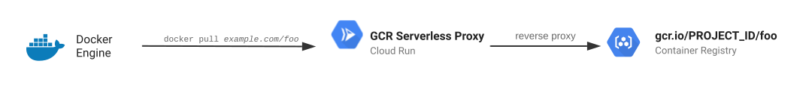

# Serverless Container Registry Proxy

This project offers a very simple reverse proxy that lets you expose your public
or private Docker registries (such as [Google Container
Registry](https://cloud.google.com/container-registry) `gcr.io`, [Google
Artifact Registry](https://cloud.google.com/artifact-registry) (`*.pkg.dev`) or
Docker Hub account) as a public registry on your own domain name.

You can also fork this project and customize as a middleware and deploy to
[Cloud Run][run] or somewhere else since it’s a generic docker registry proxy.

[](https://console.cloud.google.com/cloudshell/editor?shellonly=true&cloudshell_image=gcr.io/cloudrun/button&cloudshell_git_repo=https://github.com/ahmetb/serverless-registry-proxy)

For example, if you have a public registry, and offering images publicly with
names such as:

    docker pull gcr.io/ahmetb-public/foo
    # or
    docker pull us-central1-docker.pkg.dev/ahmetb-demo/ahmetb-demo/foo

you can use this proxy, and instead offer your images in a ✨fancier way✨ on a
custom domain, such as:

    docker pull r.ahmet.dev/foo

This project is a stateless reverse proxy, and can be deployed to a managed
compute platform such as [Cloud Run][run]. It works by reverse proxying the
[Docker Registry API v2](https://docs.docker.com/registry/spec/api/) requests
to the underlying registry:



It does not support "pushing"; however, as you push images to the underlying
registry, you can serve them on your custom domain.

You are also free to fork this project and use it as a "customizable middleware"
in front of your container image registry.

## Building

Download the source code, and build as a container image:

    docker build --tag gcr.io/[YOUR_PROJECT]/gcr-proxy .

Then, push to a registry like:

    docker push gcr.io/[YOUR_PROJECT]/gcr-proxy

## Deploying (to Google Cloud Run) for Google Container Registry (`gcr.io`)

You can easily deploy this as a serverless container to [Google Cloud Run][run].
This handles many of the heavy-lifting for you.

1. Build and push docker images (previous step)
1. Deploy to [Cloud Run][run].
1. Configure custom domain for Cloud Run service.
   1. Create domain mapping
   1. Verify domain ownership
   1. Update your DNS records
1. Have fun!

To deploy this to [Cloud Run][run], replace `[GCP_PROJECT_ID]` with the project
ID of the GCR registry you want to expose publicly:

```sh
gcloud run deploy gcr-proxy \
    --allow-unauthenticated \
    --image "[IMAGE]" \
    --set-env-vars "REGISTRY_HOST=gcr.io" \
    --set-env-vars "REPO_PREFIX=[GCP_PROJECT_ID]"
```

> This will deploy a publicly accessible registry for your
> `gcr.io/[GCP_PROJECT_ID]`, which also [needs to be
> public](https://cloud.google.com/container-registry/docs/access-control#public).
> If your GCR registry is private, see the section below on "Exposing private
> registries".

Then create a domain mapping by running (replace the `--domain` value):

```sh
gcloud run domain-mappings create \
    --service gcr-proxy \
    --domain [YOUR_DOMAIN]
```

This command will require verifying ownership of your domain name, and have you
set DNS records for your domain to point to [Cloud Run][run]. Then, it will take
some 15-20 minutes to actually provision TLS certificates for your domain name.

> Pricing Note: Cloud Run has a generous free tier. When serving from GCR using
> this proxy, the layer blobs will not be served through this proxy (as they're
> downloaded from a signed GCS URL). This saves you a lot of "billable time" and
> "egress networking" costs.

## Deploying (to Google Cloud Run) for Google Artifact Registry (`*.pkg.dev`)

Same instructions as GCR listed above. You need to just configure these
environment variables differently:

- `REGISTRY_HOST`: your regional AR domain (e.g. `us-central1-docker.pkg.dev`)
- `REPO_PREFIX`: project ID + AR Repository name (e.g.
  `ahmetb-demo/prod-images`)

> **Warning:** When using Artifact Registry, the layer blobs are downloaded
> through this proxy, and therefore will incur [more
> costs](https://cloud.google.com/run/pricing) on Cloud Run such as networking
> egress and longer execution times leading to higher "billable time".

### Deploying (elsewhere)

...is much harder. You need to deploy the application to an environment like
Kubernetes, obtain a valid TLS certificate for your domain name, and make it
publicly accessible.

### Using with other Docker Registries

If you set `REGISTRY_HOST` and `REGISTRY_PREFIX` environment variables, you can
also use this proxy for other docker registries.

For example, to proxy `docker pull ahmet/example` to Docker Hub, specify
environment variables:

- `REGISTRY_HOST=index.docker.io`
- `REPO_PREFIX=ahmet`

> **Note:** This is not tested with registries other than Docker Hub and GCR/AR.
> If you can make it work with Azure Container Registry or AWS Elastic Container
> Registry, contribute examples here.

### Run the reverse proxy using command-line flags

You can also run this tool with a single CLI command
using flags like below. Flags take precedence over environment
variables and can be useful to debug or quickly test
several configurations locally.

```sh
# Build the app
go build -o ./app

# After building the app
./app \
    -port=8080 \
    -registeryHost="index.docker.io" \
    -repoPrefix="ahmet"
```

> **Note:** This will start the reverse proxy listening on port
> 8080 without any TLS encryption. You will have to implement
> your own method of securing requests to your domain, for example
> by using [Caddy](https://caddyserver.com/docs/quick-starts/https#the-reverse-proxy-command) as a front-end.

### Exposing private registries publicly (GCR.io)

> ⚠️ This will make images in your private GCR registries publicly accessible on
> the internet.

1. Create an [IAM Service
   Account](https://cloud.google.com/iam/docs/creating-managing-service-accounts#creating_a_service_account).

1. [Give it
   permissions](https://cloud.google.com/container-registry/docs/access-control)
   to access the GCR registry GCS Bucket. (Or simply, you can give it the
   project-wide `Storage Object Viewer` role.)

1. Copy your service account JSON key into the root of the repository as
   `key.json`.

1. (Not ideal, but whatever) Rebuild the docker image with your service account
   key JSON in it. This will require editing `Dockerfile` to add `COPY` and
   `ENV` directives like:

       COPY key.json /app/key.json
       ENV GOOGLE_APPLICATION_CREDENTIALS /app/key.json
       ENTRYPOINT [...]

   You need to rebuild and deploy the updated image.

### Configuration

While deploying, you can set additional environment variables for customization:

| Key | Value |
|-----|-------|
| `REGISTRY_HOST` | specify  hostname for target registry, e.g. `gcr.io`. |
| `DISABLE_BROWSER_REDIRECTS` |  if you set this variable to any value,   visiting `example.com/image` on this browser will not redirect to  `[REGISTRY_HOST]/[REPO_PREFIX]/image` to allow your users to browse the image on GCR. If you're exposing private registries, you might want to set this variable. |
| `AUTH_HEADER` | The `Authentication: [...]` header’s value to authenticate to the target registry |
| `GOOGLE_APPLICATION_CREDENTIALS` | (For `gcr.io`) Path to the IAM service account JSON key  file to expose the private GCR registries publicly. |

-----

This is not an official Google project. See [LICENSE](./LICENSE).

[run]: https://cloud.google.com/run
